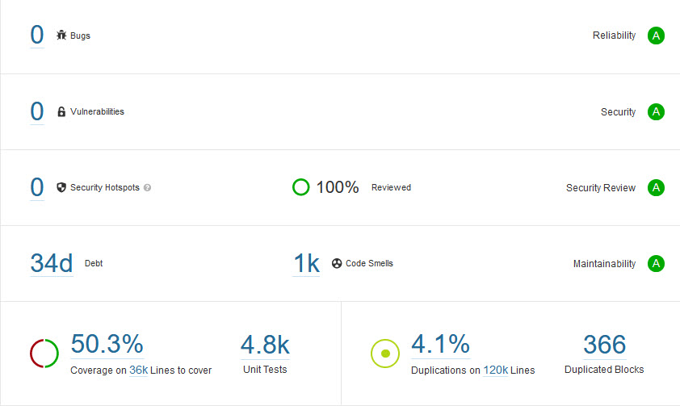

# Swiss Post Voting System

The Swiss Post Voting System is a return code-based remote online voting system that provides individual verifiability, universal verifiability, and
vote secrecy.

* Individual verifiability: allow a voter to convince herself that the system correctly registered her vote
* Universal verifiability: allow an auditor to check that the election outcome corresponds to the registered votes
* Vote secrecy: do not reveal a voter's vote to anyone

## System Documentation

We provide [extensive documentation](https://gitlab.com/swisspost-evoting/e-voting/e-voting-documentation/-/tree/master)
for the Swiss Post Voting System containing the following documents:

* [Detailed system specification](https://gitlab.com/swisspost-evoting/e-voting/e-voting-documentation/-/tree/master/System)
* [Cryptographic proofs of verifiability and vote secrecy](https://gitlab.com/swisspost-evoting/e-voting/e-voting-documentation/-/tree/master/Protocol)
* [System architecture](https://gitlab.com/swisspost-evoting/e-voting/e-voting-documentation/-/tree/master/System)
* [Infrastructure whitepaper](https://gitlab.com/swisspost-evoting/e-voting/e-voting-documentation/-/tree/master/Operations)

## Changes since 2019

Since the source code's publication in 2019, we improved the source code in the following regards.

* Aligned the source code more faithfully to the system specification.
* Increased the source code's auditability and maintainability.
* Eliminated dead code and redundancies.
* Reduced the overall number of third-party dependencies, updating the remaining in addition to improving framework usage.
* Improved the general code quality.

## Code Quality

To improve code quality, we focus on the following tools:

| Tool        | Focus                 |
|-------------|-----------------------|
| [SonarQube](https://www.sonarqube.org/)  | Code quality and code security      |
| [JFrog X-Ray](https://jfrog.com/xray/) | Common vulnerabilities and exposures (CVE) analysis, Open-source software (OSS) license compliance | |

### SonarQube Analysis

We parametrize SonarQube with the built-in Sonar way quality profile. The SonarQube analysis of the evoting code reveals 0 bugs and 0 vulnerabilities.
Moreover, we manually reviewed the security hotspots and identified no security issues. While we significantly reduced the number from the source code
of 2019, we still have >1'000 code smells in the code. [Code smells](https://docs.sonarqube.org/latest/user-guide/concepts/) are
maintainability-related issues that might increase the likelihood of errors in future code changes but do not directly impact the code's security and
robustness. An example would be a method that contains too many if/else statements, therefore has a high cognitive complexity, hence is difficult to
maintain. We plan to fix code smells continuously in future versions of the e-voting solution.



### JFrog X-Ray Analysis

At the time of writing (April 2022), the published source code contains no directly dependent Java component with known vulnerabilities.

## Change Log Release 0.14

Release 0.14 fixes the following known issues and incorporates feedback from the Federal Chancellery's mandated experts. We want to thank the experts
for their high-quality, constructive remarks:

* Vanessa Teague (Thinking Cybersecurity), Olivier Pereira (Université catholique Louvain), Thomas Edmund Haines (Australian National University)
* Aleksander Essex (Western University Canada)
* Rolf Haenni, Reto Koenig, Philipp Locher, Eric Dubuis (Bern University of Applied Sciences)

Release 0.14 includes the following functionalities and improvements:

* Allowed the SDM to request the control component keys generated in the algorithms GenKeysCCR and SetupTallyCCM.
* Enforce exactly-once processing in the control components (feedback from Rolf Haenni, Reto Koenig, Philipp Locher, and Eric Dubuis).
* Improved the alignment between code and specification in various algorithms.
* [Temporary] Replaced the election public key and Choice Return Codes encryption public key with dummy keys (see known issues below).
* Integrated the KDFtoZq method (feedback from Vanessa Teague, Olivier Pereira, and Thomas
  Haines).
* Enriched the CombineEncLongCodeShares algorithm with the lVCC allow list.
* Provided a new functionality in the config cryptographic parameters tool to generate key stores and certificates for digital signatures.
* Reorganized the control component's database tables.
* Increased the size of the Start Voting Key from 20 to 24 characters (feedback from
  Rolf Haenni, Reto Koenig, Philipp Locher, Eric Dubuis, Vanessa Teague, Olivier Pereira, and Thomas Haines).
* Removed the electoral board smart card functionality (feedback from Rolf Haenni, Reto Koenig, Philipp Locher, and Eric
  Dubuis).
* Removed the legacy cryptolib ElGamal key pair generation functionality (feedback from Rolf Haenni, Reto Koenig, Philipp Locher, and Eric
  Dubuis).
* Removed the unused verification card set issuer, ballot box signer, and credential ID signing key pair.
* Remove SecureLogging functionality from control components since it is no longer required with the protocol improvements.
* Updated the version of H2 database, fixing the vulnerability [CVE-2022-23221](https://cve.mitre.org/cgi-bin/cvename.cgi?name=CVE-2022-23221).
* Updated outdated and vulnerable dependencies.
* Various minor improvements.

## Change Log Release 0.13

Release 0.13 incorporates feedback from the Federal Chancellery's mandated experts (see above), improves the alignment of the Swiss Post Voting
System, and contains the following changes:

* Introduced a new robust message broker service for communication with the control components.
* Implemented synchronisation (via a database locking mechanism) during key generation operations. Introducing message validation and additional
  locking mechanisms to prevent mulitiple different responses to the same message. (feedback from Rolf Haenni, Reto Koenig, Philipp Locher, and Eric
  Dubuis).
* Incorporated the HashAndSquare operation before exponentiating to the Confirmation Key (feedback from Vanessa Teague, Olivier Pereira, and Thomas Haines).
* Merged the control components' Return Codes and mixing services.
* Implemented the partial Choice Return Codes allow list in the GenVerDat and CreateLCCShare algorithms. This point refers
  to [Gitlab issue #7](https://gitlab.com/swisspost-evoting/e-voting/e-voting-documentation/-/issues/7).
* Implemented the DecryptPCC_j algorithm in the control components.
* Implemented the CreateVote algorithm using a TypeScript implementation of the crypto-primitives implementation (open-source).
* Aligned the following algorithms:
  * CreateVote
  * VerifyBallotCCR
  * PartialDecryptPCC (this point solves the issue #YWH-PGM2323-51 mentioned
    in [Gitlab issue #32](https://gitlab.com/swisspost-evoting/e-voting/e-voting-documentation/-/issues/32))
  * DecryptPCC
* Removed key compression (feedback from Vanessa Teague, Olivier Pereira, and Thomas Haines).
* Removed the readObject method which could lead to insecure deserializations. This point refers to issue #YWH-PGM2323-44 mentioned
  in [Gitlab issue #32](https://gitlab.com/swisspost-evoting/e-voting/e-voting-documentation/-/issues/32).
* Fixed the lack of exception control in the class SanitizerDataHttpServletRequestWrapper This point refers to issue #YWH-PGM2323-45 mentioned
  in [Gitlab issue #32](https://gitlab.com/swisspost-evoting/e-voting/e-voting-documentation/-/issues/32).
* Added the missing element to the signature of the ReturnCodeGenerationInput object (fixes
  the [Gitlab issue #4](https://gitlab.com/swisspost-evoting/e-voting/e-voting/-/issues/4))
* Removed unused cryptolib code for ElGamal encryption and zero-knowledge proofs (feedback from Rolf Haenni, Reto Koenig, Philipp Locher, and Eric
  Dubuis).
* Merged both Secure Data Manager backends and removed the second dependency on an external Tomcat application server (plus its associated WAR
  artifacts).
* Updated outdated and vulnerable dependencies.

## Change Log Release 0.12

Release 0.12 incorporates feedback from the Federal Chancellery's mandated experts (see above), facilitates the development of the Swiss Post Voting
System's verifier, and contains the following changes:

* Updated references and component names to align with the latest draft version of the Ordinance on Electronic Voting (OEV).
* Aligned the control components' zero-knowledge proofs to the system specification using the crypto-primitives implementation. Previously, we
  indicated this point as a known issue. Specifically, we improved the alignment of the algorithms:
  * CreateLCCShare
  * CreateLVCCShare
  * ExtractCRC
  * ExtractVCC
* Implemented the generation of prime numbers for encoding voting options using the crypto-primitives GetSmallPrimeGroupMembers method (feedback from
  Rolf Haenni, Reto Koenig, Philipp Locher, Eric Dubuis, Vanessa Teague, Olivier Pereira, and Thomas Haines).
* Moved shared domain objects to the crypto-primitives-domain library.
* Persisted the MixnetInitialPayload in the Secure Data Manager to allow its subsequent verification in the verifier.

Moreover, release 0.12 contains the following bug fixes and improvements. These points do not impact the implementation of the cryptographic protocol.

* Fixed a minor bug by using ordinal-style query parameters in Hibernate.
* Fixed a bug affecting the high-availability environment by changing the database integration in the control components.
* Removed the requirement to have an activated administration board in the SDM for downloading the ballot boxes.
* Simplified the build by refactoring the voting server POM files.
* Moved the findGroupGenerator method to the crypto-primitives library.
* Updated outdated and vulnerable dependencies.
* Various minor improvements.

## Known Issues

IMPORTANT: We are currently doing a major refactoring in release 0.14 of the source code and we replaced the
actual election public key and Choice Return Codes encryption public key with dummy keys.
We are going to replace the dummy keys with the actual keys in release 0.15.
Therefore, release 0.14 must be considered as an intermediary release that is not fully
aligned to the system specification.

Moreover, we highlight the following non-exhaustive list of missing functionalities.

* The setup component does not verify the control components' Schnorr proofs of knowledge
  of correct key generation in the SetupTallyEB algorithm.
* The control components do not yet implement the new ConfirmVote protocol.
* The control components and the Tally control component do not yet implement the new Tally protocol.
* The control components and voting server omit many signature and consistency checks during the voting phase.
* The control components do not yet have a robust way for handling certificates and verifying signatures.
* The control components do not check the zero-knowledge proofs in the DecryptPCC algorithm (due to missing public keys).
* The control components do not check the list of ballot boxes that they already partially decrypted. This refers
  to [Gitlab issue #11](https://gitlab.com/swisspost-evoting/e-voting/e-voting-documentation/-/issues/11)

Moreover, we plan to address the following issues in future releases:

* Implement an allow list when copying files from USB keys (
  fixes [Gitlab issue #5](https://gitlab.com/swisspost-evoting/e-voting/e-voting/-/issues/5))
* Write-ins are currently not supported
* The voter portal (a component considered untrustworthy in our threat model) is built using AngularJS. Even though there are long-term support
  options, covering both security weaknesses and future browser compatibility support, ideally, the frontend would be migrated to / rewritten in
  Angular.
* In some cases, publicly writable directories are used as temporary storage. The security risk associated is mitigated as we run such services in a
  containerized environment, where we control all the running processes. We plan to remove the use of temporary storage completely.

## Future Work

We plan the following work for future releases.

* Explicitly implement the DecodePlaintexts algorithm. Currently, the output of the system consists of the encoded voting options (prime numbers).
  Please note that the verifier checks the decoding of the prime numbers.
* Reduce the number of code smells and increase test coverage. We will prioritize code that implements important elements of the cryptographic
  protocol.
* The voting server is *untrusted*: we distributed many functionalities to the mutually independent control components in the current protocol.
  However, for historical reasons, the voting server still performs additional validations not strictly necessary from the protocol point of view.
  Moreover, the voting server uses the JavaEE framework, while the other parts of the solution use SpringBoot. To improve maintainability, we want to
  reduce the voting server's responsibility to the strict minimum and align it to SpringBoot.
* Ensure reproducible builds, see the [section on reproducible builds](#reproducible-builds).

## Limitations

Regardless of how well-built a software system is, technical debt accrues over time. The architecture documentation (chapter 11) lists technical
debts.

Moreover, no cryptographic protocol is unconditionally secure.
The [cryptographic protocol's documentation](https://gitlab.com/swisspost-evoting/e-voting/e-voting-documentation/-/tree/master/Protocol#limitations)
highlights limitations regarding quantum-resistance, attacks against vote privacy on a malicious voting client, and a trustworthy printing component.

## Build Prerequisites

We tested the build with the following operating systems:

* Windows (Microsoft Windows 10 Enterprise)
* Linux (CentOS 7)

Please note that you might have to adapt specific steps if you use a different operating system or distribution.

### Enable Long Path (Windows)

Long paths can be enabled as explained
here: [https://docs.microsoft.com/en-us/windows/win32/fileio/maximum-file-path-limitation#enable-long-paths-in-windows-10-version-1607-and-later](https://docs.microsoft.com/en-us/windows/win32/fileio/maximum-file-path-limitation#enable-long-paths-in-windows-10-version-1607-and-later)

Restarting your machine is required for this change to be effective. Activate long paths for Git with the command below:

```sh
git config --global core.longpaths true
```

### Clone the Project

1. Install [Git](https://git-scm.com/)
2. Clone this repository with the command below:

```sh
git clone https://gitlab.com/swisspost-evoting/e-voting/e-voting.git
```

### Prepare Build Environment

You must install the following tools to build the e-voting solution. We recommend installing them in a dedicated directory (e.g., C:
\work\jrepo-local\tools).

| Name     | Version    | Source    | Install Location (if installed under C:\work\jrepo-local\tools)    | Remarks |
| --------|---------|---------|---------|---------|
| **Java**  | Temurin OpenJDK 1.8.0_312b07    | [https://github.com/adoptium/temurin8-binaries/releases/tag/jdk8u312-b07](https://github.com/adoptium/temurin8-binaries/releases/tag/jdk8u312-b07) | C:\work\jrepo-local\tools\java\java-jdk1.8.0_312b07 ||
| **Chrome** | > = 59 | [https://www.google.com/intl/de/chrome/](https://www.google.com/intl/de/chrome/) | Default ||
| **Node** | 14.17.5  | [https://nodejs.org/dist/v14.17.5/](https://nodejs.org/dist/v14.17.5/) | C:\work\jrepo-local\tools\node\node-v14.17.5-x64 ||
| **Maven** | 3.8.5  | [https://archive.apache.org/dist/maven/maven-3/3.8.5/binaries/](https://archive.apache.org/dist/maven/maven-3/3.8.5/binaries/) | C:\work\jrepo-local\tools\maven\maven-3.8.5 ||
| **PhantomJS** | 2.1.1 | [https://bitbucket.org/ariya/phantomjs/downloads/phantomjs-2.1.1-windows.zip](https://bitbucket.org/ariya/phantomjs/downloads/phantomjs-2.1.1-windows.zip) | C:\work\jrepo-local\tools\phantomjs\phantomjs-2.1.1-windows ||
| **Docker** | 4.5.1 | [https://desktop.docker.com/win/main/amd64/Docker%20Desktop%20Installer.exe](https://desktop.docker.com/win/main/amd64/Docker%20Desktop%20Installer.exe) | Default | Docker is only needed if you want to execute the integration tests. You can also disable them by adding `-DskipITs` to mvn build command

#### Prepare Environment Variables

Create the following system environment variables (adapt them to the location you installed the build tools in the step above):

| Name     | Version    |
| --------|---------|
| **DOCKER_REGISTRY**  | registry.gitlab.com/swisspost-evoting/e-voting/evoting-e2e-dev  |
| **EVOTING_HOME**  | C:\work\projects\e-voting (it should point to the directory where this repository was cloned)    |
| **JAVA_HOME** | C:\work\jrepo-local\tools\java\java-jdk1.8.0_312b07 |
| **MAVEN_HOME** | C:\work\jrepo-local\tools\maven\maven-3.8.5  |
| **NODE_HOME** | C:\work\jrepo-local\tools\node\node-v14.17.5-x64  |
| **NPM_ROAMING_HOME** | C:\Users\\${username}\AppData\Roaming\npm  |
| **PHANTOMJS_HOME** | C:\work\jrepo-local\tools\phantomjs\phantomjs-2.1.1-windows |

Linux distributions might require an additional environment variable CHROME_BIN pointing towards Chrome or Chromium. You can set the environment
variable as follows:

```sh
`export CHROME_BIN==$(which chromium google-chrome | awk '!/not found/'
```

#### Prepare PATH

Add the following lines to your PATH system environment variable:

```sh
%JAVA_HOME%\bin
%MAVEN_HOME%\bin
%NODE_HOME%\
%NPM_ROAMING_HOME%\
%PHANTOMJS_HOME%\bin
```

#### Install Node Modules

Install the following NPM dependencies globally to allow a complete build of the frontends of the e-voting solution:

```sh
npm install -g grunt-cli@1.3.2
npm install -g gulp-cli@2.3.0
```

### Install Manual Third-Party Dependencies

The Secure Data Manager requires a PKCS11wrapper, developed by IAIK of Graz University of Technology, for interacting with SmartCards. The PKCS11
wrapper is not available in public repositories but can be obtained for free from IAIK's website under an Apache-style license (you can find the
license in the Secure Data Manager directory).

Therefore, you have to obtain yourself a copy of the
iaikPkcs11Wrapper [https://jce.iaik.tugraz.at/products/core-crypto-toolkits/pkcs11-wrapper/](https://jce.iaik.tugraz.at/products/core-crypto-toolkits/pkcs11-wrapper/)
and install it as a maven artifact using the following command:

```sh
mvn install:install-file -Dfile=iaikPkcs11Wrapper_1.6.2.jar -DgroupId=iaik -DartifactId=iaikPkcs11Wrapper -Dversion=1.6.2 -Dpackaging=jar 
```

### Check Environment Before Your First Build

Before your first build, you should check your environment using the provided script :

```sh
 cd ./scripts/
 ./environment-checker.sh
```

### Docker image

If you want to avoid preparing your own environment for the build, we provide a Docker image, based on a Linux distribution, with the main elements
already installed. The Docker image is located in the `scripts` directory, in a file
named [evoting-build.Dockerfile](./scripts/evoting-build-linux.Dockerfile). All the steps that will then remain are:

Our integration tests use Docker and a link between the Docker daemon host and the container is needed. If you're ok with this security-relevant
action, then set the build argument USE_DOCKER_HOST to true. Otherwise, the image will simply not contain Docker and you will have to skip the
integration tests by adding the following parameter `-DskipITs` to the maven build command.

* Build the Docker image.

  ```sh
  docker build --build-arg USE_DOCKER_HOST=true -f evoting-build-linux.Dockerfile -t evoting-build .
  ```

* Run a container based on the previous image. Give at least 4Go of memory to the Docker daemon

  ```sh
  docker run -v <static-path-directory-to-exchange-data>:/home/baseuser/data -v //var/run/docker.sock:/var/run/docker.sock -it -t evoting-build
  ```

* Clone the project

  ```sh
  git clone -b <branchOrTagName> https://gitlab.com/swisspost-evoting/e-voting/e-voting.git
  ```

* [Install the third-party dependencies](#install-manual-third-party-dependencies) as described above
* [Launch the full build](#full-build) as described below

## Build

### Full Build

1. Check the versions used for crypto-primitives, crypto-primitives-domain and crypto-primitives-ts in ./e-voting/evoting-dependencies/pom.xml
2. Clone the related versions of crypto-primitives, crypto-primitives-domain and crypto-primitives-ts
3. Build the crypto-primitives, crypto-primitives-domain and crypto-primitives-ts
4. Build the e-voting solution:

```sh
 git clone -b <branchOrTagName> https://gitlab.com/swisspost-evoting/crypto-primitives/crypto-primitives.git
 cd crypto-primitives && mvn clean install && cd ..
 git clone -b <branchOrTagName> https://gitlab.com/swisspost-evoting/crypto-primitives/crypto-primitives-domain.git
 cd crypto-primitives-domain && mvn clean install && cd ..
 git clone -b <branchOrTagName> https://gitlab.com/swisspost-evoting/crypto-primitives/crypto-primitives-ts.git
 cd crypto-primitives-ts && mvn clean install && cd ..
 cd e-voting && mvn clean install
```

### Partial Build

If you want to build partially the solution (only a module) :

```sh
 cd ./your-module/
 mvn <goals>
```

### Reproducible Builds

We aim to provide [reproducible builds](https://reproducible-builds.org/), allowing researchers to verify the path from source code to binaries.
Currently, the build pipeline for the frontend artifacts is not entirely deterministic; we are evaluating different solutions to make the frontend
build reproducible (see [future work](#future-work)).

## Run

See the repository [evoting-e2e-dev](https://gitlab.com/swisspost-evoting/e-voting/evoting-e2e-dev) for instructions on how to simulate an election
event.

Certain operations run significantly faster using native optimizations. You can check
the [crypto-primitives readme](https://gitlab.com/swisspost-evoting/crypto-primitives/crypto-primitives) for configuring native library support.

In contrast to the productive infrastructure, the development environment omits specific security elements such
as [HTTP security headers](https://owasp.org/www-project-secure-headers/), [DNSSEC](https://www.nic.ch/security/dnssec/)
, [OCSP](https://www.ietf.org/rfc/rfc2560.txt), and [CAA records](https://support.dnsimple.com/articles/caa-record/). You can check the voter portal
README to check our productive configuration of [HTTP security headers](https://owasp.org/www-project-secure-headers/).
